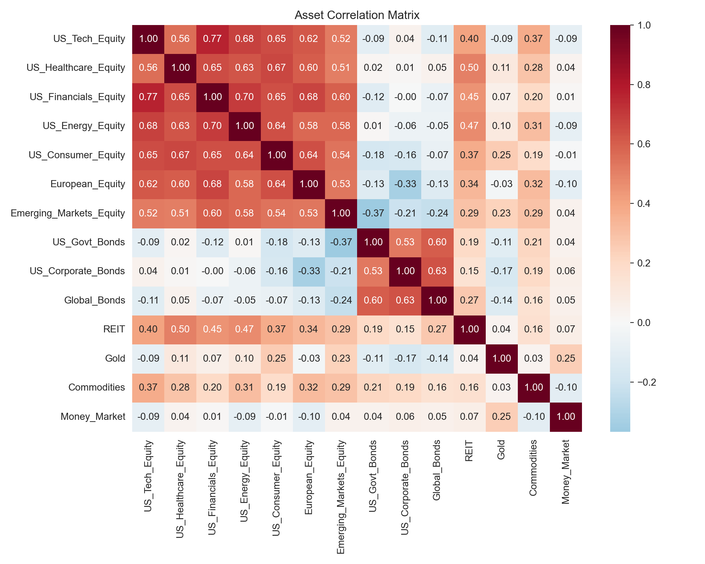
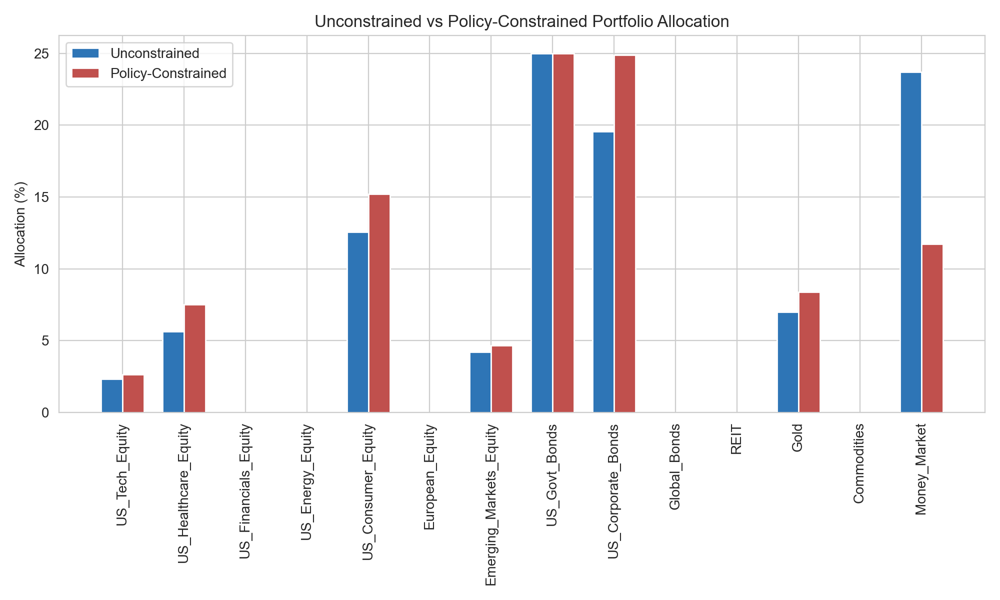
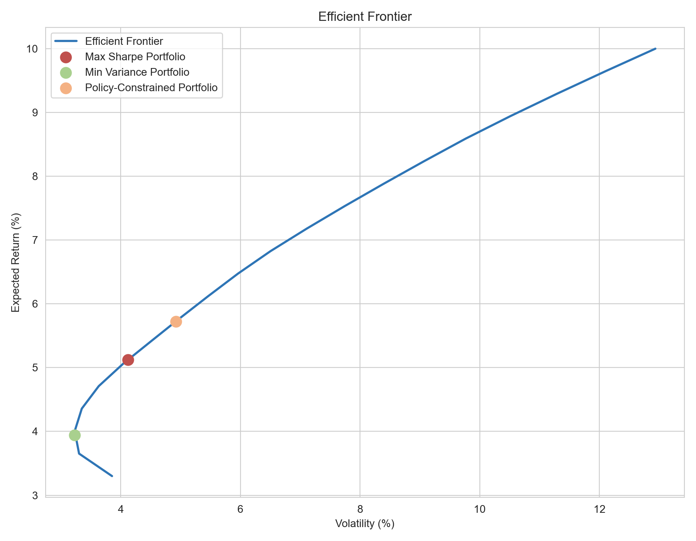

# Investment Portfolio Optimization — Decision Modelling Under Constraints

**A mean-variance optimization and constrained decision-modelling project across 14 assets, quantifying exactly what realistic institutional investment policy limits cost (or don't cost) in risk-adjusted return.**

<p align="center">
  
  
  
  
</p>

> *Optimizing an unconstrained 14-asset portfolio found the textbook-optimal answer — but forcing it to respect realistic institutional investment policy limits changed almost nothing about risk-adjusted return, while revealing that the "optimal" portfolio actually wanted less equity than any real investment policy would allow.*

---

## 🎯 Business Context

Institutional investors rarely get to hold the mathematically optimal portfolio — investment policy statements impose minimum bond holdings, maximum single-asset and sector exposure, and other guardrails for reasons that have nothing to do with a spreadsheet's optimizer. That creates a real decision question for whoever sets or reviews that policy: **how much risk-adjusted return, if any, is actually being given up to satisfy those constraints — and is a specific constraint doing real work, or just adding friction for no benefit?** This project answers that with numbers instead of assumption, by solving the same optimization twice — once unconstrained, once under realistic policy limits — and quantifying the exact gap between them.

---

## 🎯 The Decision Problem

An investor has capital to allocate across 14 assets spanning equities, fixed income, alternatives, and cash. The question: how should that capital be split to get the best possible risk-adjusted return — and what does it actually cost, in return given up, to also satisfy realistic investment policy limits rather than optimizing with no constraints at all?

---

## 🛠️ Tools & Techniques

| Stage | Tool | Technique |
|---|---|---|
| Data quality | pandas | Missing-value, implausible-return-range, and correlation-structure sanity checks before trusting the risk model built on top of the data |
| Risk modelling | pandas, NumPy | Annualized covariance matrix from historical monthly returns, paired deliberately with forward-looking (not historical) return assumptions — because 60 months is enough data to estimate risk reliably but not average return |
| Unconstrained optimization | SciPy (`minimize`, SLSQP) | Maximum Sharpe ratio and minimum variance portfolios, solved as constrained nonlinear optimization problems (weights sum to 1, no short-selling, per-asset cap) |
| Constrained / policy optimization | SciPy (`minimize`, SLSQP) | The same optimization re-solved under realistic institutional limits (sector-level inequality constraints), so the two solutions are directly comparable |
| Decision modelling | Custom Python functions | Isolating which single constraint is binding (doing the work) versus which are slack, to explain *why* the constrained answer differs from the unconstrained one, not just *that* it differs |
| Efficient frontier | SciPy | Re-solving minimum variance across a grid of target returns to confirm both candidate portfolios sit on the frontier, not strictly inside it |
| Cross-validation | Excel Solver | The identical model rebuilt in Excel with Solver, to confirm the Python and spreadsheet-based approaches agree on the same optimal answer |
| Visualization | matplotlib, seaborn | Correlation heatmap, side-by-side allocation comparison, and efficient frontier scatter to make the constraint's cost visually inspectable |

---

## 🧹 Data Overview & Quality Checks

5 years (60 months) of return data across 14 assets, built to realistic risk/return/correlation assumptions rather than pulled from a live market feed (see Limitations). Checked for missing months, implausible return values, and correlation structure sanity — all clean.

**Worth knowing:** 60 months is enough to estimate *risk* (volatility, correlation) reliably, but genuinely too short to estimate *average return* reliably — several assets assumed to return 8-14% a year actually averaged under 2% over this specific window, which is expected statistical noise, not a data problem. This is exactly why the optimization uses forward-looking return assumptions rather than the noisy historical average, combined with the historical covariance matrix (which *is* a reliable estimate from this data).

---

## 📈 Part 1 — Unconstrained Optimization



With no constraints beyond "no short-selling" and "max 25% in any one asset," the optimizer leans heavily on bonds, cash, and gold — several equity sectors get 0% allocation entirely.

| Portfolio | Return | Volatility | Sharpe |
|---|---|---|---|
| Max Sharpe (unconstrained) | 5.12% | 4.12% | 0.758 |
| Min Variance (unconstrained) | 3.94% | 3.23% | — |

---

## ⚡ Part 2 — Constrained Optimization (Realistic Investment Policy)



Applying realistic institutional limits (Equity 30-70%, Fixed Income ≥15%, Alternatives ≤20%, Cash ≤25%):

| Portfolio | Return | Volatility | Sharpe |
|---|---|---|---|
| Max Sharpe (policy-constrained) | 5.72% | 4.92% | 0.757 |

> **Insight:** The equity floor (30%) is the binding constraint — the unconstrained optimizer actually wanted *less* equity than policy requires. Being forced into more equity raises both return (+0.60%) and risk (+0.80% vol), but the Sharpe ratio barely moves (-0.001). In plain terms: the policy constraint doesn't meaningfully hurt risk-adjusted return here — it just trades a bit more risk for a bit more return, at roughly the same efficiency.

---

## 🔎 Part 3 — Efficient Frontier



All three portfolios (unconstrained max Sharpe, min variance, policy-constrained) sit on or very near the efficient frontier — confirming none of them are leaving obvious risk/return trade-offs on the table.

---

## ✅ Recommendation & Impact

1. **Adopt the policy-constrained max Sharpe portfolio** — respects realistic institutional limits while giving up almost nothing in risk-adjusted return vs. the theoretical optimum
2. **The 30% equity floor is doing real work** — without it, the optimizer would hold less equity than most investment policies allow
3. **Both optimized portfolios clearly beat naive equal-weighting** (Sharpe 0.758/0.757 vs 0.524 for a plain 1/14 split) — diversification alone isn't the same as optimization
4. **Every result depends on the input assumptions** — this is the single biggest real-world caveat of mean-variance optimization (see Limitations)

---

## 📂 What's in here

- **`src/portfolio_optimization.py`** — full analysis: problem → data quality → EDA → unconstrained optimization → constrained optimization → cost-of-constraints comparison → efficient frontier → recommendations
- **`excel/Portfolio_Optimizer.xlsx`** — the same model rebuilt for Excel Solver: asset data, covariance matrix, and Solver-ready decision cells, pre-loaded with the verified-correct answer
- **`outputs/`** — 3 charts: correlation matrix, allocation comparison, efficient frontier
- **`data/`** — `monthly_returns.csv` (60 months × 14 assets) and `asset_info.csv` (sector + return/risk assumptions)

---

## ▶️ Running the Python version
```bash
git clone <this-repo-url>
cd investment-portfolio-optimization-decision-modelling
pip install -r requirements.txt
cd src
python portfolio_optimization.py
```

## ▶️ Running the Excel version
Open `excel/Portfolio_Optimizer.xlsx` — the optimal answer is already loaded in the Weight column, computed with Excel's Solver add-in against the `Assets` and `Covariance` sheets.

---

## 🧠 Skills Demonstrated

- **Optimization & decision modelling** — formulating and solving constrained nonlinear optimization problems (mean-variance, max Sharpe, min variance) using SciPy, with realistic real-world constraints layered on top
- **Quantitative risk modelling** — building a covariance-based risk model from historical data while correctly recognizing what that data can and can't reliably estimate (risk vs. return)
- **Constraint analysis** — identifying which specific constraint is binding versus slack, so a recommendation explains *why* an outcome changed, not just that it did
- **Comparative decision-making** — benchmarking optimized solutions against a naive baseline (equal-weighting) to prove optimization is adding real value, not just complexity
- **Cross-tool validation** — rebuilding the same model in Excel Solver to confirm the Python optimization result independently, rather than trusting one implementation alone
- **Business communication under uncertainty** — being explicit about which results are assumption-dependent and how sensitive the recommendation is to those assumptions, rather than presenting a single point estimate as certainty

---

## ⚠️ Limitations & Future Directions

- **Not live market data** — the return/risk/correlation assumptions are realistic but constructed, not pulled from an actual market feed. Every number in this analysis is only as good as those assumptions.
- **Every optimization result is assumption-dependent** — change the expected return inputs even slightly and the optimal weights can shift meaningfully. A real deployment would need sensitivity analysis across a range of plausible assumptions, not just one point estimate.
- **No transaction costs or rebalancing constraints** — the model assumes frictionless, instant rebalancing to the target weights, which isn't realistic in practice.
- **No estimation of parameter uncertainty** — the analysis doesn't quantify how confident we should be in the covariance matrix itself, which is itself an estimate from a finite sample.
- Next step if continued: run the optimization across a grid of plausible return assumptions to see how sensitive the "optimal" allocation actually is — if it swings wildly, that's a sign the point estimate shouldn't be trusted too heavily.

---

## 📝 About This Project

Independent portfolio project demonstrating optimization and decision modelling under constraints. Not investment advice, and not based on any real portfolio or client data.

---

<p align="center">Made with 📊 by Angella Nantongo</p>
